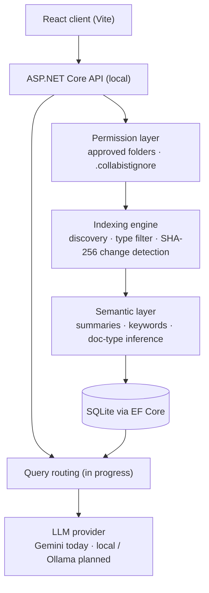

# Collabist

**A local-first AI knowledge assistant.** Collabist indexes the folders you approve once, builds a persistent semantic map of your files in the background, and uses that map to answer questions with the right context, so you never have to re-upload documents or pick a knowledge base for each query.

> **Status:** active development. The permission layer, indexing engine and semantic layer are working. Query routing and local-LLM execution are in progress. See [TASKS.md](TASKS.md) for the full roadmap.

## Why Collabist?

Most AI assistants treat every question as stateless. Collabist does the opposite:

- **Index once, not every time.** Approved folders are indexed a single time and kept up to date by change detection.
- **Knowledge persists across sessions.** Context is selected automatically from what has already been indexed.
- **Explicit, auditable access.** Only folders you approve are read, and `.collabistignore` excludes anything sensitive.
- **Private by default.** Files stay on your machine, and the model provider is pluggable.

## Architecture



The server follows a layered layout: `Domain/` (entities), `Application/` (DTOs and services), `Infrastructure/` (persistence, file system, AI) and `Controllers/` (HTTP API).

## Features

**Working today**
- One-time folder approval with persistent permission storage
- Internal knowledge-base scoping, with no mixing of data across permission boundaries
- Recursive file discovery, file-type filtering and `.collabistignore` rules
- SHA-256 hashing for change detection, with resumable, restart-safe indexing
- File-level semantic summaries, keyword extraction and document-type inference
- Onboarding flow and data-source settings in the React client
- Gemini-backed responses

**In progress**
- Query classification and semantic routing to relevant documents
- Context-window-aware context assembly
- Local model execution (Ollama-compatible) and bring-your-own API key
- Desktop quick-chat overlay, then team and organisation workspaces

## Tech stack

| Layer | Technology |
|---|---|
| Client | React 19, Vite 7 |
| Server | ASP.NET Core (.NET 10), Swagger / OpenAPI |
| Storage | Entity Framework Core + SQLite |
| AI | Google Gemini REST API (pluggable provider interface) |

## Getting started

**Prerequisites:** [.NET 10 SDK](https://dotnet.microsoft.com/download), Node.js 20+, and a [Gemini API key](https://aistudio.google.com/app/apikey).

```bash
git clone https://github.com/Madhavyamjala/CollabistAI-p.git
cd CollabistAI-p/Collabist.Server

# store the API key outside source control
dotnet user-secrets init
dotnet user-secrets set "Gemini:ApiKey" "<your-key>"

# apply database migrations and run (the SPA proxy starts the React client too)
dotnet ef database update
dotnet run
```

The API listens on `http://localhost:5031` and Swagger UI is at `/swagger`. To run the client on its own:

```bash
cd collabist.client
npm install
npm run dev
```

## Design principles

- **Correctness over demos.** Every layer is persistent and resumable before features are added on top.
- **Built to scale without rewrites.** The same architecture serves one person, a startup and an enterprise.
- **Model-agnostic.** No hard dependency on any single AI provider.

## License

License to be decided.
